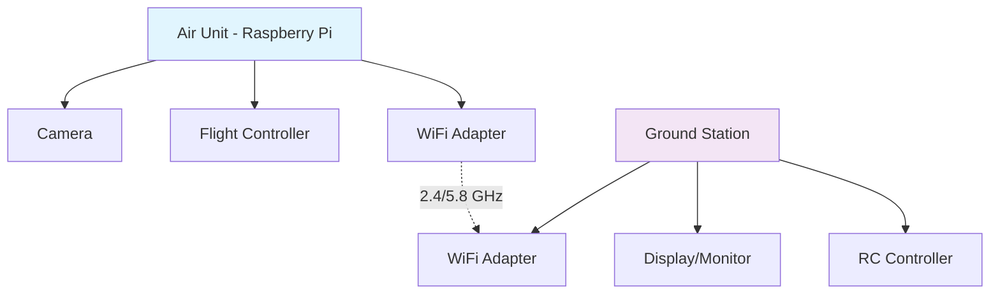
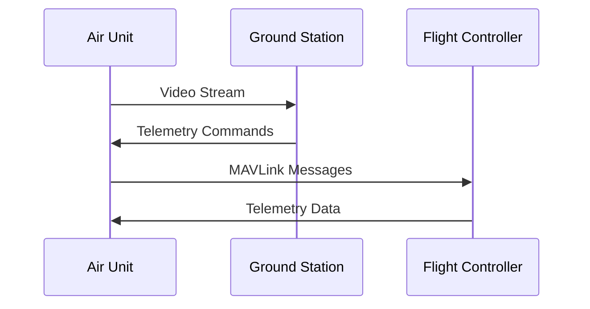

# MDX Features Examples

This page demonstrates enhanced MDX features available in the OpenHD documentation.

## Admonitions (Callouts)

### Different Types
::: note
This is a note admonition. Use for general information.
:::

::: tip
This is a tip admonition. Use for helpful suggestions.
:::

::: warning
This is a warning admonition. Use for important cautions.
:::

::: danger
This is a danger admonition. Use for critical warnings like hardware damage.
:::

::: info
This is an info admonition. Use for additional context.
:::

## Mermaid Diagrams

### Connection Diagram


### System Architecture


## Interactive Features

### Tabs for Multiple Options

import Tabs from '@theme/Tabs';
import TabItem from '@theme/TabItem';

<Tabs>
  <TabItem value="raspberry" label="Raspberry Pi" default>
    
**Installation for Raspberry Pi:**
```bash
sudo apt update
sudo apt install openhd
```

  </TabItem>
  <TabItem value="radxa" label="Radxa Rock5">
    
**Installation for Radxa Rock5:**
```bash
sudo apt update
sudo apt install openhd-radxa
```

  </TabItem>
  <TabItem value="x86" label="X86 Systems">
    
**Installation for X86:**
```bash
wget -O - https://repo.openhd.org/setup.sh | sudo bash
```

  </TabItem>
</Tabs>

## Enhanced Tables with Sorting

| Hardware | Recommended | Latency | Price Range |
|----------|:-----------:|:-------:|:-----------:|
| Pi Camera V2 | ⭐⭐⭐⭐⭐ | Low | $25-30 |
| Pi HQ Camera | ⭐⭐⭐⭐ | Low | $50-60 |
| USB Camera | ⭐⭐⭐ | Medium | $20-100 |
| IP Camera | ⭐⭐ | High | $50-200 |

## Code Blocks with Highlighting

```bash title="Setup OpenHD on Raspberry Pi"
# Download latest image
wget https://github.com/OpenHD/OpenHD-Image/releases/latest/openhd-pi.img.xz

# Flash to SD card
sudo dd if=openhd-pi.img of=/dev/sdX bs=4M status=progress

# Enable SSH (optional)
touch /media/boot/ssh
```

```python title="Custom telemetry script"
#!/usr/bin/env python3
import json
import socket

def send_telemetry_data(data):
    """Send custom telemetry to OpenHD"""
    try:
        sock = socket.socket(socket.AF_INET, socket.SOCK_UDP)
        sock.sendto(json.dumps(data).encode(), ('127.0.0.1', 14550))
        sock.close()
        return True
    except Exception as e:
        print(f"Error: {e}")
        return False

# Example usage
telemetry = {
    "battery_voltage": 12.6,
    "current": 5.2,
    "temperature": 35
}

if send_telemetry_data(telemetry):
    print("Telemetry sent successfully")
```

## Math Expressions (LaTeX)

For technical calculations:

Antenna gain calculation: $G = 10 \log_{10}(G_{linear})$ dBi

Signal path loss: $L = 20 \log_{10}(d) + 20 \log_{10}(f) + 32.45$

Where:
- $d$ = distance in km
- $f$ = frequency in MHz

## Custom Components

import { useState } from 'react';

export const WifiChannelCalculator = () => {
  const [frequency, setFrequency] = useState(2412);
  const channel = Math.floor((frequency - 2412) / 5) + 1;
  
  return (
    <div style={{
      padding: '20px',
      border: '2px solid #4CAF50',
      borderRadius: '8px',
      marginBottom: '20px',
      backgroundColor: '#f8f9fa'
    }}>
      <h4>WiFi Channel Calculator</h4>
      <label>
        Frequency (MHz): 
        <input 
          type="number" 
          value={frequency} 
          onChange={(e) => setFrequency(parseInt(e.target.value))}
          min="2412"
          max="2484"
          step="5"
          style={{marginLeft: '10px', padding: '5px'}}
        />
      </label>
      <p><strong>Channel: {channel}</strong></p>
      <p><em>Useful for configuring WiFi adapters</em></p>
    </div>
  );
};

<WifiChannelCalculator />

## File Downloads

Download configuration files:

<a 
  href="/files/openhd-default.conf" 
  download="openhd.conf"
  style={{
    display: 'inline-block',
    padding: '10px 20px',
    backgroundColor: '#4CAF50',
    color: 'white',
    textDecoration: 'none',
    borderRadius: '5px',
    marginRight: '10px'
  }}
>
  📁 Download Default Config
</a>

<a 
  href="/files/hardware-template.conf" 
  download="hardware.conf"
  style={{
    display: 'inline-block',  
    padding: '10px 20px',
    backgroundColor: '#2196F3',
    color: 'white',
    textDecoration: 'none',
    borderRadius: '5px'
  }}
>
  ⚙️ Download Hardware Template
</a>